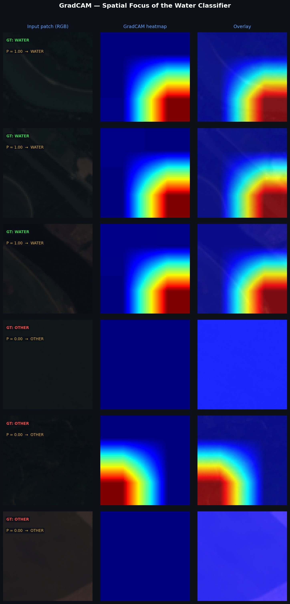
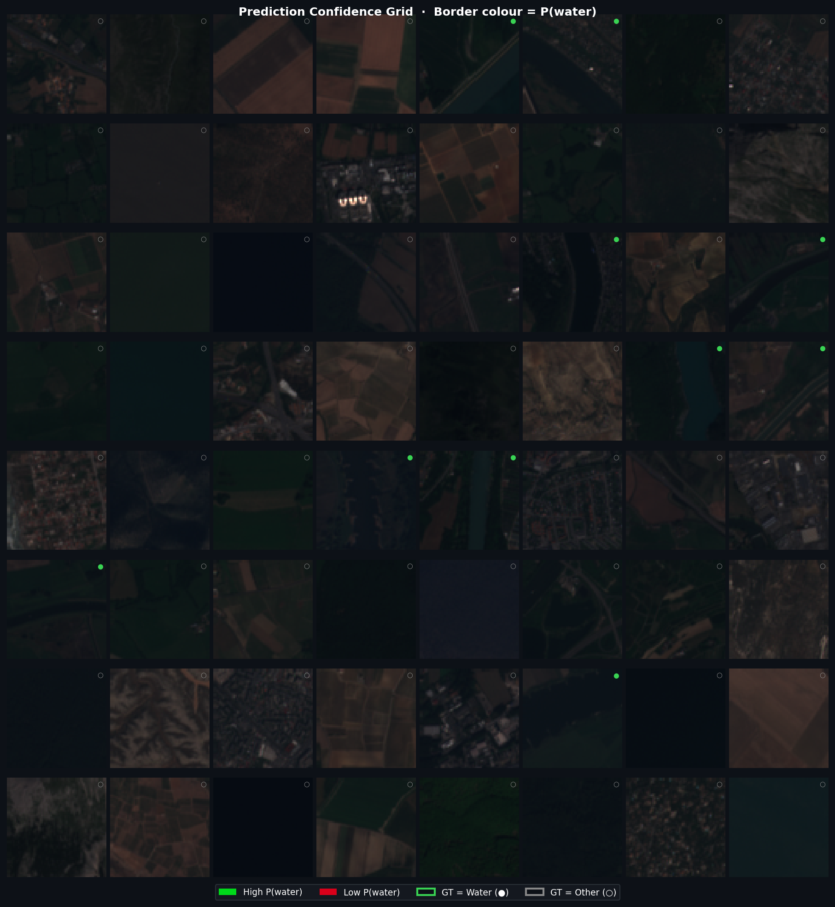
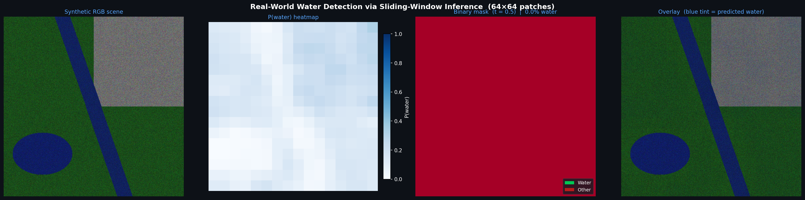

# EuroSAT Binary Water Detection

Binary classification of Sentinel-2 satellite patches: **Water vs. Other**  
Backbone: ResNet-50 | Framework: PyTorch Lightning + TorchGeo

## Results

| Metric    | Value  |
|-----------|--------|
| F1-Score  | 0.9786 |
| Precision | 0.9812 |
| Recall    | 0.9761 |
| AUROC     | 0.9934 |

## Visualisations

### GradCAM — where the model looks

### Prediction Confidence Grid

### Real-World Sliding Window Inference

## Run on Kaggle

## Pretrained Checkpoint

Download from Google Drive: [[link here](https://disk.yandex.ru/d/S10-hsONSz-9Xw)]

## Structure

\`\`\`
notebook/   — Jupyter notebook (training + visualisations)
results/    — Output figures
report/     — LaTeX report (IEEE 2-page format)
\`\`\`